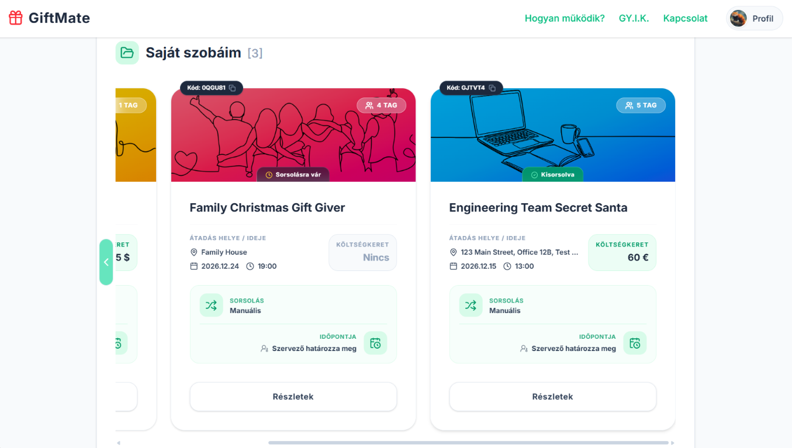
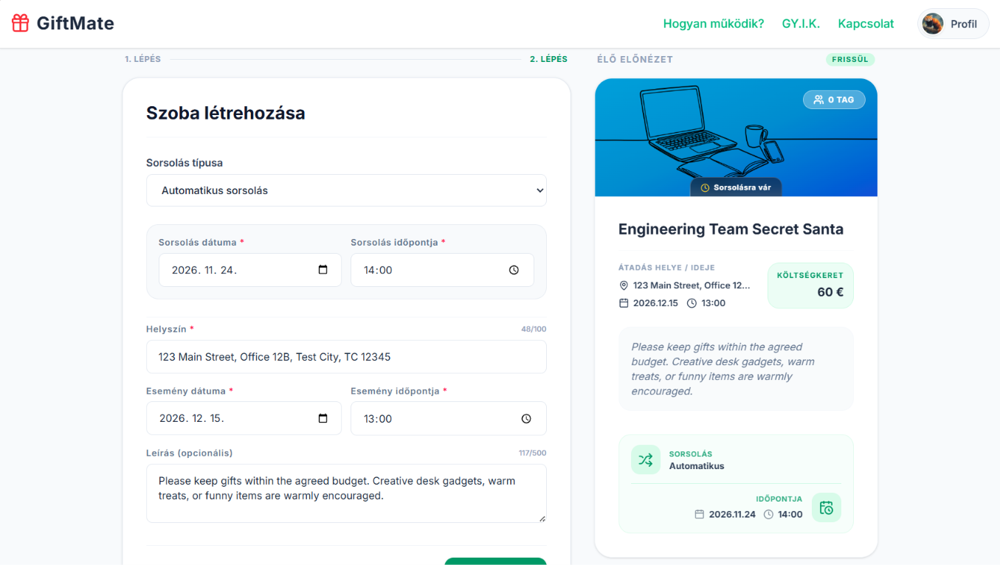
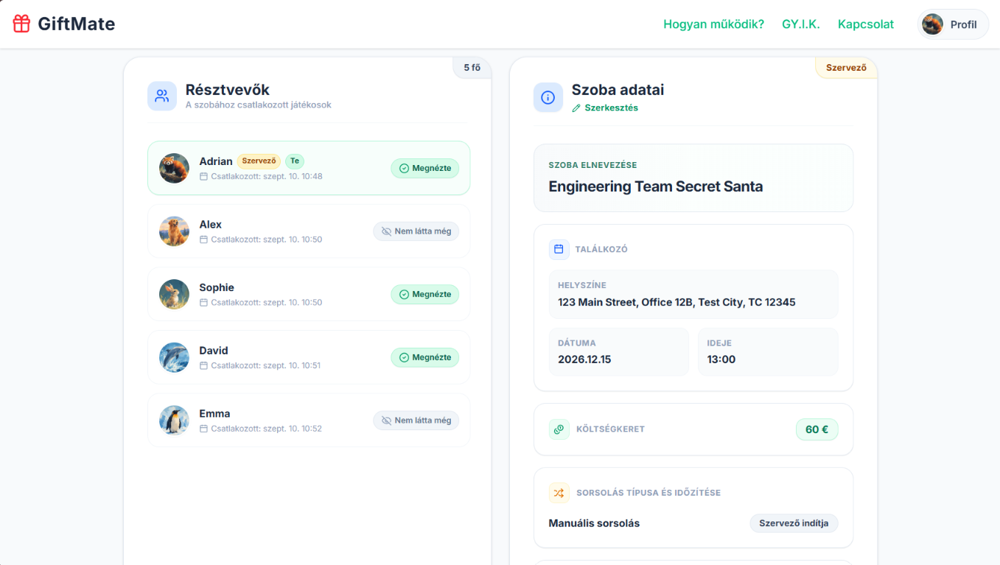
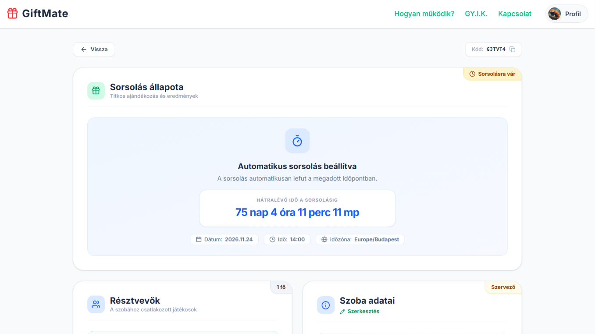
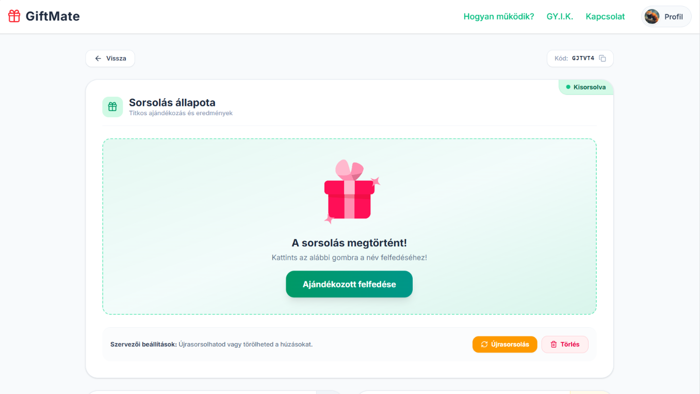
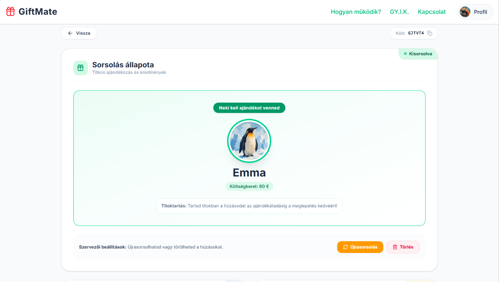
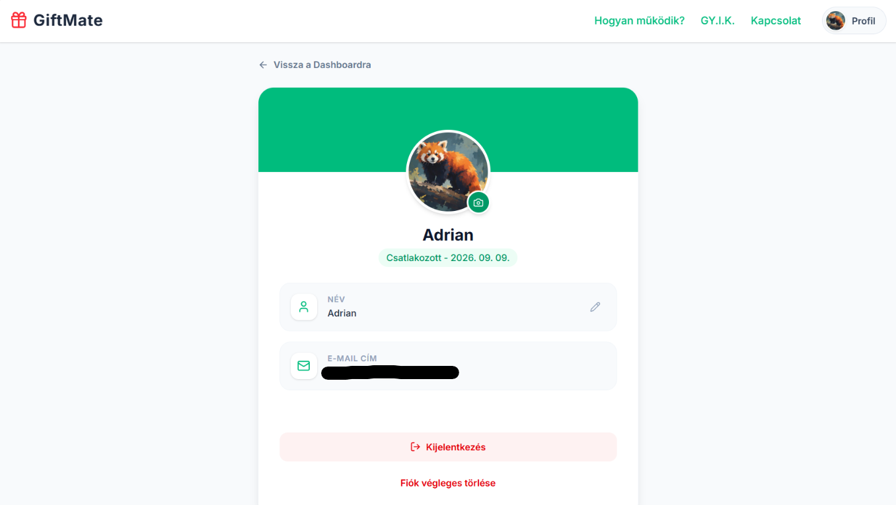
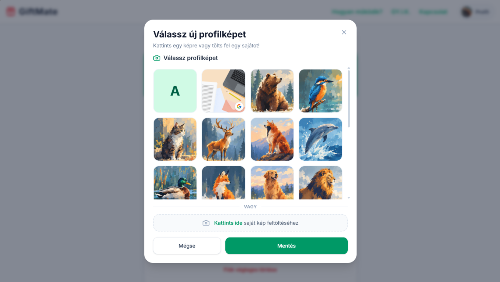
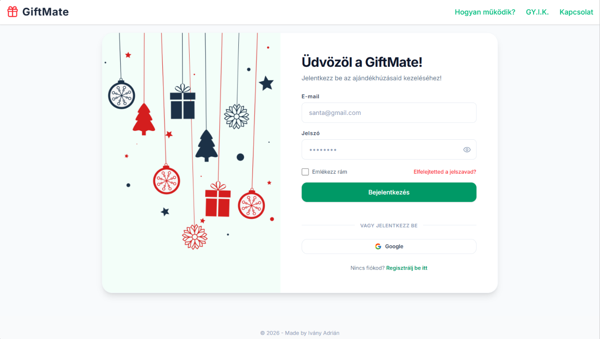

# GiftMate — Modern, Valós Idejű Secret Santa Platform

[English](README.md) | **Magyar**

[](https://react.dev/)
[](https://www.typescriptlang.org/)
[](https://vitejs.dev/)
[](https://tailwindcss.com/)
[](https://supabase.com/)
[](https://www.postgresql.org/)
[](https://vercel.com/)
[](LICENSE)

A **GiftMate** egy modern, full-stack, valós idejű Secret Santa webalkalmazás, amely **React 19**, **TypeScript**, **Tailwind CSS v4** és **Supabase (PostgreSQL)** technológiákra épül.

Az alkalmazás **Row Level Security (RLS)** szabályokkal, atomi **PostgreSQL tárolt eljárásokkal (RPC)** és **valós idejű WebSocket feliratkozásokkal** biztosítja a garantáltan fair, titkos párosítást és a kliensoldali csalások teljes kizárását.

>
> ### Élő Demó Fiók (Kipróbálás Regisztráció Nélkül)
>
> A GiftMate azonnal, külön regisztráció nélkül is kipróbálható a nyilvános bemutató fiókkal:
>
> - **E-mail:** `demo@giftmate.app`
> - **Jelszó:** `DemoPassword`
>
> A fiók egy előre berendezett, **védett bemutató szobával** érkezik, amely fiktív résztvevőkkel van feltöltve. A szoba épségének és folytonosságának megőrzése érdekében a destruktív műveletek (szoba törlése, tagok eltávolítása, szobából való kilépés vagy újként csatlakozás) mind a felületen, mind az adatbázis RPC szintjén le vannak tiltva. **Ezen kívül minden funkció szabadon és korlátlanul kipróbálható**: a szoba adatai (név, költségkeret, helyszín, dátumok) módosíthatók, a sorsolás lebonyolítható, a partnerkártya felfedhető, a sorsolás visszavonható/újrapróbálható, illetve tetszőleges új szobák is létrehozhatók!

---

## Alkalmazás Képgaléria

### Vezérlőpult & Szobakészítés

|              Aktív szobák a vezérlőpulton               |         Többlépéses szobakészítő varázsló          |
| :-----------------------------------------------------: | :------------------------------------------------: |
|  |  |

### Szobanézet & Valós Idejű Számláló

|           Szoba adatai & résztvevők listája            |                  Automatikus sorsolási időzítő                   |
| :----------------------------------------------------: | :--------------------------------------------------------------: |
|  |  |

### Csalásbiztos Sorsolás & Leleplezés

|               Lezárolt sorsolási állapot                |            Lekaparós leleplező partnerkártya             |
| :-----------------------------------------------------: | :------------------------------------------------------: |
|  |  |

### Profil & Avatár-Ökoszisztéma

|    Felhasználói profil & beállítások    |            20 egyedi nagyfelbontású állatavatár            |
| :-------------------------------------: | :--------------------------------------------------------: |
|  |  |

<details>
<summary> <strong>Bejelentkezési Képernyő Megtekintése (Google OAuth + Email)</strong></summary>

<br />

<p align="center">
  
</p>

</details>

---

## Főbb Jellemzők & Rendszerarchitektúra

### Zero-Trust Biztonság & Csalásbiztos Sorsolás

- **Symmetric Secret Isolation**: Minden sorsolás közvetlenül a PostgreSQL adatbázisban, `SECURITY DEFINER` jogosultságú tárolt eljárásban (`perform_draw`) fut le. Egyetlen résztvevő sem tudja kideríteni a párosításokat a hálózati forgalom (Network tab) vizsgálatával vagy közvetlen adatbázis-lekérdezésekkel.
- **Szigorú Row Level Security (RLS)**: A kliensoldali szerepkörök (anon/authenticated) `0` közvetlen `INSERT`, `UPDATE` vagy `DELETE` joggal rendelkeznek a kritikus táblákon (`rooms`, `room_members`, `draws`). Az állapotmódosítások kizárólag szigorúan ellenőrzött tárolt eljárásokon keresztül hajthatók végre.
- **Szelektív Adatkitettség**: A `draws` tábla RLS szabálya szigorúan csak a `drawer_id = auth.uid()` feltételt engedélyezi. Még a tábla közvetlen vizsgálata esetén is a lekérdező kizárólag a saját húzottját kapja vissza — a teljes sorsolási lánc rejtve marad.
- **Szobaszintű Adatvédelem**: A profilok és felhasználói adatok elérése kizárólag azokra a felhasználókra korlátozódik, akikkel közös aktív szobában vagyunk jelen.

### Egyetlen Kéréses Hidratálás & Alacsony Késleltetésű UX

- **Konszolidált Állapothidratálás (`get_room_full_details`)**: Egymás után láncolt API hívások (`rooms.select` $\rightarrow$ `get_room_members` $\rightarrow$ `get_my_draw`) helyett egyetlen atomi JSONB RPC tölti be a szoba metaadatait, a résztvevők névsorát és az adott felhasználó húzottját egyetlen hálózati kéréssel (single roundtrip).
- **Valós Idejű WebSockets**: Azonnali szinkronizáció a kliensek között Supabase Realtime csatornákon (`room_hub_${id}`). Automatikusan frissül a csatlakozott tagok listája, a sorsolási készenlét és a leleplezési állapot.
- **Időzóna-Tudatos Visszaszámláló**: Támogatja az automatikus sorsolási időzítést helyi időzóna-eltolódásokkal, türelmi idővel és optimista állapotfrissítésekkel.

### Interaktív Demó Környezet & Szerepkör Védelem

- **Nyilvános Demó Fiók Védelem**: A nyilvános bemutató fiók (`demo@giftmate.app`) védve van az e-mail cím módosításától, a jelszó-visszaállítástól és a fióktörléstől mind a felületen, mind a PostgreSQL RPC szintjén.
- **Védett Demó Szoba (`U1J1TN`)**: Előre konfigurált, fiktív résztvevőkkel feltöltött szoba, ahol a destruktív műveletek (szoba törlése, tagok eltávolítása, kilépés, új tagok csatlakozása) adatbázis-szinten blokkolva vannak, miközben a szoba testreszabása és a sorsolási folyamat szabadon kipróbálható.
- **Vizuális Állapotjelvények**: Megkülönböztető `VÉDETT` lakat (`Lock`) jelvénnyel rendelkezik a vezérlőpulti kártyán és a szoba címsorában.

### UX Optimalizációk & Dinamikus Névsor-Prioritás

- **Intelligens Névsor-Rendezés**: A szoba szervezője mindig a résztvevők legtetején (`#1`) jelenik meg, közvetlenül utána az aktuális bejelentkezett felhasználó (`#2` - "Te"), így nagy létszámú szobákban is azonnal átlátható a saját szerepünk.
- **Kronologikus Vezérlőpult Rendezés**: A szobák a csatlakozási időpont szerint növekvő sorrendben jelennek meg (`my_rm.joined_at ASC`), biztosítva, hogy a legrégebbi (elsődleges) szobák mindig elöl, bal oldalon maradjanak.

### Design Rendszer & Ünnepi Mikro-Interakciók

- **Tailwind CSS v4 Architektúra**: Egyedi reszponzív töréspont (`xs: 380px`), amely a legkisebb okostelefon-kijelzőkön is tökéletes megjelenést biztosít.
- **Lottie Vektoros Animációk**: Finom, hardveresen gyorsított mikro-interakciók az ünnepi harangjátékhoz, ajándék kibontásához, konfetti ünnepléshez és állapotbetöltőkhöz.
- **Egységesített Avatár-Ökoszisztéma**: 20 egyedi nagyfelbontású WebP állatavatár, szinkron Google OAuth profilkép-beolvasás és közvetlen Supabase Storage integráció automatikus fájl takarítással.

---

## Technológiai Stack

| Réteg                      | Technológiák & Eszközök                                                          |
| :------------------------- | :------------------------------------------------------------------------------- |
| **Frontend Keretrendszer** | [React 19](https://react.dev/) + [TypeScript](https://www.typescriptlang.org/)   |
| **Build & Eszközök**       | [Vite 6](https://vitejs.dev/), [Oxlint](https://oxc.rs/)                         |
| **Stílus & Layout**        | [Tailwind CSS v4](https://tailwindcss.com/), [Lucide React](https://lucide.dev/) |
| **Animációk**              | [@lottiefiles/dotlottie-react](https://lottiefiles.com/)                         |
| **Backend as a Service**   | [Supabase](https://supabase.com/)                                                |
| **Adatbázis & Biztonság**  | [PostgreSQL 15](https://www.postgresql.org/), PL/pgSQL, Row Level Security (RLS) |
| **Valós Idejű Motor**      | Supabase Realtime Channels                                                       |
| **Objektumtárhely**        | Supabase Storage                                                                 |
| **Tárhely & Telepítés**    | [Vercel](https://vercel.com/)                                                    |

---

## Mappastruktúra

```text
GiftMate/
├── public/
│   ├── avatars/             # 20 egyedi nagyfelbontású WebP állatavatár
│   ├── banners/             # Ünnepi téma előnézeti grafikák
├── src/
│   ├── assets/
│   │   └── animations/      # Lottie animációs JSON és DotLottie fájlok
│   ├── components/
│   │   ├── ui/              # Modális ablakok, Toast értesítések, Szobakártyák
│   │   ├── LottieLoader.tsx # Lottie lejátszó fallback réteggel
│   │   ├── Navbar.tsx       # Reszponzív navigációs sáv auth szinkronizációval
│   │   ├── RoomDrawResult.tsx # Sorsolási eredmény / leleplező felület
│   │   ├── RoomInfo.tsx     # Szobaadatok & beállítások kezelője
│   │   └── RoomMembers.tsx  # Résztvevők listája & tagkezelés
│   ├── hooks/
│   │   ├── useClipboard.ts  # Vágólapra másolás visszajelzéssel
│   │   └── useRoomDetails.ts # Központi szobaállapot, realtime hub & RPC hívások
│   ├── pages/
│   │   ├── CreateRoom.tsx   # Többlépéses szobakészítő varázsló
│   │   ├── Dashboard.tsx    # Főoldali vezérlőpult & szobakódos csatlakozás
│   │   ├── Login.tsx        # Bejelentkezés Google OAuth és jelszó támogatással
│   │   ├── Profile.tsx      # Felhasználói profil, név és avatár beállítások
│   │   ├── Register.tsx     # Új fiók regisztrációs űrlap
│   │   ├── RoomDetails.tsx  # Secret Santa szoba fő nézete
│   │   └── UpdatePassword.tsx # Jelszó-helyreállítás és visszaállítás
│   ├── utils/
│   │   └── avatar.ts        # Tárhely útvonal-kezelők & avatár segédfüggvények
│   ├── App.tsx              # React Router v7 útvonalak & modál portál
│   ├── index.css            # Tailwind v4 téma, kulcsképkockák & komponensek
│   ├── main.tsx             # Alkalmazás belépési pont
│   └── supabaseClient.ts    # Supabase SDK singleton példány
├── supabase/
│   └── functions/           # PostgreSQL RPC definíciók (PL/pgSQL forrásfájlok)
├── .env.example             # Szükséges környezeti változók sablonja
├── .gitignore               # Szigorú ignore szabályok (titkos kulcsok, cache)
├── package.json             # Függőségek és npm scriptek
├── vercel.json              # Vercel SPA átirányítási (rewrite) szabályok
└── vite.config.ts           # Vite csomagoló & Tailwind konfiguráció
```

---

## Telepítés és Helyi Futtatás

Kövesd az alábbi lépéseket a GiftMate helyi futtatásához a gépeden:

### 1. Előfeltételek

- **Node.js** 18.x vagy újabb verzió
- **npm**, **yarn** vagy **pnpm** csomagkezelő
- Ingyenes **Supabase** fiók ([supabase.com](https://supabase.com))

### 2. A Repository Klónozása

```bash
git clone https://github.com/ivanyadrian/GiftMate.git
cd GiftMate
```

### 3. Környezeti Változók Beállítása

Hozz létre egy helyi `.env` fájlt a gyökérkönyvtárban a minta alapján:

```bash
cp .env.example .env
```

Nyisd meg a `.env` fájlt, és másold be a saját Supabase projektadataidat:

```env
VITE_SUPABASE_URL=https://your-project-id.supabase.co
VITE_SUPABASE_ANON_KEY=your-supabase-anon-key
```

### 4. Függőségek Telepítése & Fejlesztői Szerver Indítása

```bash
npm install
npm run dev
```

Az alkalmazás helyileg elérhető a `http://localhost:5173` címen.

### 5. Production Build & Ellenőrzés

A végleges, optimalizált kód helyi teszteléséhez:

```bash
npm run build
npm run preview
```

---

## Adatbázis Architektúra & Tárolt Eljárások

Az adatbázis séma és a GiftMate által használt PostgreSQL függvények a `supabase/functions/` könyvtárban találhatók:

- **`create_room`**: Ütközésbiztos, 6 karakteres szobakódokat generál és atomi műveletben regisztrálja a szoba tulajdonosát.
- **`join_room_by_code`**: Ellenőrzi a szobakódot, kikényszeríti a megjelenített nevek egyediségét és védi a zárolt demó szobát.
- **`leave_room`**: Lehetővé teszi a kilépést a sorsolatlan szobákból, miközben meggátolja a védett demó szoba elhagyását.
- **`delete_room`**: Biztosítja, hogy csak a szervező törölhesse a szobát, miközben gátolja a bemutató szoba törlését.
- **`kick_room_member`**: Moderációs jogot ad a szervezőnek tagok eltávolítására a védett szobák integritásának megőrzése mellett.
- **`update_room_details`**: Módosítja a szoba beállításait, miközben a sorsolás lefutása után zárolja a kritikus paramétereket.
- **`get_room_full_details`**: Egyetlen hívásos állapothidratálás, amely összefűzi a metaadatokat, a tagok listáját és a saját húzottat.
- **`get_my_rooms`**: Időrendben (a tagság kezdetének sorrendjében) kérdezi le az aktuális felhasználó aktív szobáit.
- **`perform_draw`**: Véletlenszerű derangement (teljes rendezetlenség) algoritmust hajt végre, garantálva, hogy senki sem húzhatja saját magát.
- **`delete_draw`**: Visszavonja a sorsolást, visszaállítva a szobát sorsolás előtti állapotba és törölve a korábbi húzásokat.
- **`reveal_my_draw`**: Nyilvántartja, hogy a résztvevő megtekintette-e már a kisorsolt partnerét.
- **`update_profile_username`**: Szobaszinten egyedi megjelenített nevet követel meg az azonos nevű résztvevők elkerülése érdekében.
- **`delete_current_user`**: Biztonságosan törli a fiókadatokat, miközben védi a nyilvános demó profilt a törléstől.

---

## Licenc

Ez a projekt nyílt forráskódú szoftver az [MIT Licenc](LICENSE) feltételei szerint.
